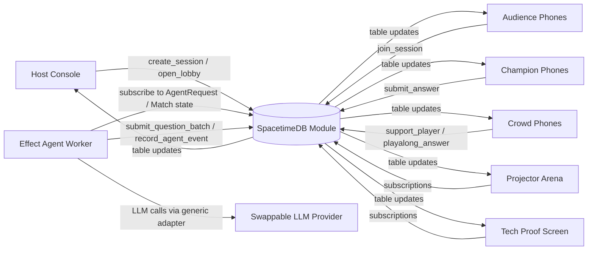

# QuizDuel Live

Two players battle live, the crowd cheers from their phones, AI agents generate and explain the quiz, and reducer-owned realtime state synchronizes every tap, score, cheer, leaderboard, and state transition.

Memory sentence for judges:

> The one where the whole room scanned one QR code and became part of a live AI-powered quiz duel.

QuizDuel Live uses non-redeemable educational game XP only. There is no purchase, cash prize, withdrawal, transfer, or real-world value.

## What It Does

- Host creates a session for `AI + Space + Startups`.
- AI quiz generation uses a provider-neutral Effect worker with deterministic fallback questions.
- Projector lobby shows a QR code and live join counts.
- Phones join as Champion candidates or Crowd supporters.
- Exactly two Champions are selected through a reducer.
- Players answer timed questions.
- Crowd supporters play along and Cheer with non-redeemable Energy.
- Scores, support bars, metrics, round results, AI explanations, and leaderboards update live.

## What Works

- Full React app with routes for host, lobby, join, reveal, arena, player phone, crowd phone, tech overlay, and final leaderboard.
- Laptop-hosted WebSocket reducer gateway for multiple local devices on the same Wi-Fi.
- Shared reducer engine with transaction-style rollback and invariant tests.
- Build-verified SpacetimeDB TypeScript module in `modules/spacetime`.
- Effect-based agent worker package with provider-neutral LLM adapter and fallback seed provider.
- Deterministic demo mode, reset script, seed script, and 10 fallback questions.

## Prototype Scope

- Default web demo uses the local reducer gateway for no-login laptop reliability.
- The SpacetimeDB module builds successfully and preserves the table/reducer contract, but generated React bindings are not wired as the default client transport yet.
- Production auth, payments, redeemable balances, long-term profiles, and content marketplace are intentionally not built.
- LLM provider calls are configurable; missing credentials automatically use seed fallback questions.

## Run Locally

```bash
pnpm install
pnpm dev
```

Open:

- Host: http://localhost:5174/host
- Lobby: http://localhost:5174/lobby/session-demo
- Join: http://localhost:5174/join/ARENA-42
- Arena: http://localhost:5174/arena/session-demo
- Tech proof: http://localhost:5174/tech/session-demo

For phones on the same Wi-Fi, set:

```bash
VITE_PUBLIC_APP_URL=http://YOUR_LAPTOP_IP:5174
VITE_REALTIME_URL=ws://YOUR_LAPTOP_IP:8787
pnpm dev
```

## Golden Path

1. Open `/host`.
2. Click `Generate AI Quiz`.
3. Click `Open Lobby`.
4. Open `/lobby/session-demo` on the projector.
5. Scan the QR from at least two phones and choose `I want to play`.
6. Join everyone else as Crowd.
7. In Host Console, click `Select Champions`.
8. Open `/arena/session-demo/reveal`, then start the match.
9. Players answer on `/play/session-demo`.
10. Crowd cheers and plays along on `/crowd/session-demo`.
11. Host resolves each round and advances.
12. Show `/arena/session-demo/final` and `/tech/session-demo`.

## SpacetimeDB

Install and build:

```bash
curl -sSf https://install.spacetimedb.com | sh
pnpm spacetime:build
```

Run local SpacetimeDB in another terminal:

```bash
pnpm spacetime:start
```

Publish the module locally:

```bash
pnpm spacetime:publish:local
```

SpacetimeDB is used as the authoritative backend contract in `modules/spacetime`: tables are public for subscriptions, and all game-critical state changes are reducers. The local gateway mirrors this reducer model for judged demos when generated bindings are not enabled.

## AI Agents

The worker package lives in `apps/agent-worker` and defines:

- Quiz Author Agent
- Fairness Review Agent
- Host Commentator Agent
- Learning Recap Agent

Configuration is provider-neutral:

```bash
LLM_API_BASE_URL=
LLM_API_KEY=
LLM_MODEL_ID=
LLM_SMALL_MODEL_ID=
LLM_PROVIDER_NAME=generic
LLM_TIMEOUT_MS=12000
LLM_MAX_RETRIES=2
LLM_JSON_MODE=true
```

## Test

```bash
pnpm test
pnpm typecheck
pnpm build
pnpm spacetime:build
```

Critical reducer tests cover Energy grants, Champion selection, duplicate answer rejection, Cheer deduction, double-spend prevention, invalid amount rejection, idempotent round resolution, support cap, missing speed bonus on wrong answers, and malformed LLM fallback rejection.

## Architecture



See `docs/architecture.md` for full diagrams.

## Next Best Improvement

Wire generated SpacetimeDB TypeScript bindings into `apps/web/src/lib/spacetime/client.ts` behind a `VITE_USE_SPACETIMEDB=true` switch, replacing the local gateway transport while keeping the existing hooks and UI unchanged.
