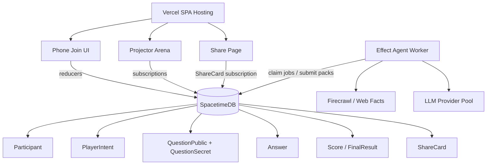
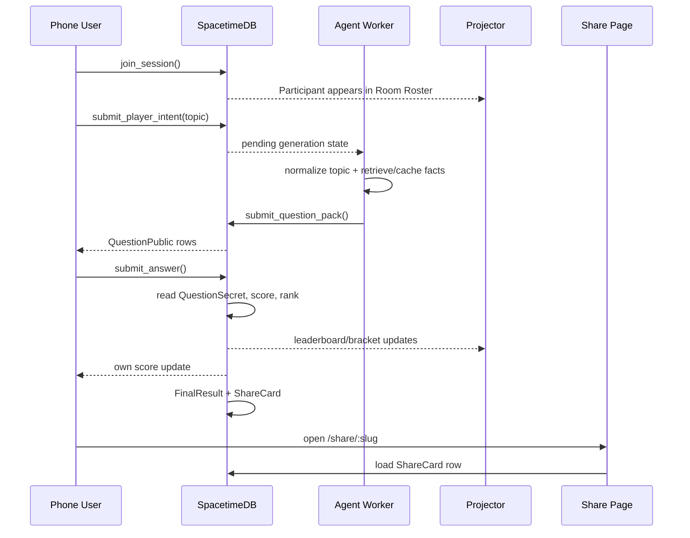

# QuizRush Arena

A 25-second AI-personalized quiz tournament from one QR code.

> The whole room scanned one QR code, shared expertise, and became a live AI-generated tournament in 25 seconds.

QuizRush Arena uses educational game scoring only. There is no purchase, cash prize, withdrawal, transfer, or real-world value.

## Problem Statement

Passive learning loses attention; active learning improves outcomes. A PubMed-indexed meta-analysis of active learning in STEM found exam scores improved by about 6 percentage points and students in traditional lecture sections were 1.5x more likely to fail than students in active-learning sections.

Room-scale quiz games usually make everyone answer the same static question set. That breaks when every player wants a different topic, and it becomes unsafe at scale if the frontend invents score, answer timing, ranking, or share links.

QuizRush Arena solves this as a realtime state race:

- phones are private quiz controllers,
- the projector is a public live tournament broadcast,
- SpacetimeDB is the authoritative race database,
- the agent worker generates grounded quiz packs and writes them back through reducers,
- Vercel hosts the web UI and share pages.

## Product Solution

Users scan one QR, create a profile, type or speak any topic in natural language, answer a private quiz sprint, and see the room move through a public live bracket. Every result is stored as database state and every participant gets a durable score-card link.

```mermaid
flowchart LR
    Phone[Phone Player] -->|join/profile/topic| DB[(SpacetimeDB)]
    Phone -->|submit_answer reducer| DB
    Worker[Effect Agent Worker] -->|facts + quiz pack reducers| DB
    DB --> Questions[QuestionPublic rows]
    DB --> Score[Score / FinalResult]
    DB --> Share[ShareCard slug]
    Projector[Projector Live Bracket] -->|subscriptions| DB
    Vercel[Vercel Web App] --> Phone
    Vercel --> Projector
    Vercel --> SharePage[/share/:slug]
```

## Why This Is Different

Existing live quiz tools are usually shared-question polling surfaces. QuizRush Arena is built around personalized topics plus a shared realtime race engine:

- **Personalized input:** every player can ask for a different topic.
- **Database-authoritative race:** client code does not decide score, rank, official timing, winner, or share URL.
- **Public/private split:** phones show private questions; the projector shows only the public bracket, leaderboard, roster, and champion.
- **Durable share cards:** score links are rows in SpacetimeDB, not URL-encoded text.
- **Admission control:** the app caps active racers to measured capacity and tracks overflow users instead of crashing.
- **Demo resilience:** if Firecrawl/LLM is slow, deterministic topic-specific fallback questions keep the sprint running.

## Research And Market Context

- Active learning research supports the product direction: the Freeman et al. meta-analysis reports about 6 percentage-point higher exam performance and substantially lower failure risk for active-learning sections.
- Global Market Insights estimated the game-based learning market at USD 23.45B in 2023 with projected CAGR above 14% from 2024 to 2032.
- QuizRush Arena focuses that demand into a room-scale, personalized, realtime game loop: custom topics on phones, shared bracket on the projector, database-backed scorecards after the sprint.

Sources:

- Active learning paper: https://pmc.ncbi.nlm.nih.gov/articles/PMC4060654/
- Game-based learning market: https://www.gminsights.com/industry-analysis/game-based-learning-market

## Current Production Status

```text
Stable app: https://quizel-eta.vercel.app
Projector: https://quizel-eta.vercel.app/arena/ARENA-42
Phone join: https://quizel-eta.vercel.app/join/ARENA-42
SpacetimeDB module: quizrush-live on maincloud
```

Measured on 2026-06-07:

| Scenario | Result |
| --- | --- |
| 50 connected active racers | Pass: 500/500 answers committed, 50 FinalResult rows, 50 ShareCard rows |
| 100 connected active racers | Pass: 1000/1000 answers committed, 100 FinalResult rows, 100 ShareCard rows |
| Active admitted racers | Keep hard cap at 100 |
| 250 connected tracked users | Measured fail under overflow pressure; not claimed |

The projector now separates these surfaces:

- **Live Bracket:** admitted active racers only.
- **Leaderboard:** ranked scoring surface.
- **Room Roster:** every tracked participant profile, including queued/watching users.

See [docs/capacity-report.md](docs/capacity-report.md) for exact artifacts.
Use [docs/multiplayer-debugging.md](docs/multiplayer-debugging.md) and `make diagnose SESSION=ARENA-42` when validating a live room.

## What It Does

QuizRush Arena turns a room into a live multiplayer quiz race. The deployed demo runs from Vercel plus the `quizrush-live` SpacetimeDB module, the projector shows a clean game-broadcast lobby, everyone joins from a phone, players type a topic, deterministic intent parsing creates a participant-scoped quiz pack, phones show private quiz prompts, and the projector shows only the public live bracket, roster, leaderboard, capacity state, and winner.

## Demo Flow

1. Use the deployed projector at `https://quizel-eta.vercel.app/arena/ARENA-42`, or run `make online-public` for local rehearsal.
2. Projector opens `/arena/ARENA-42` and shows the QR.
3. Audience scans the QR and joins `/join/ARENA-42`.
4. Everyone enters name/avatar and a natural-language topic.
5. Each phone stores a `PlayerIntent`, calls participant-scoped `request_questions`, and receives its own topic-specific `QuestionPublic` rows.
6. The projector roster and topic bubbles update from real `Participant` and `PlayerIntent` rows.
7. The presenter starts the race with `S` only after the room is ready. Real-user races do not auto-start.
8. Phones answer ten rapid private questions inside the race clock.
9. Projector updates the live bracket and leaderboard from committed SpacetimeDB state without showing quiz questions.
10. Winner screen shows champion, score, fastest answer, sound, and confetti.
11. Every participant receives a `FinalResult` and can create/open a reducer-backed `ShareCard` link.
12. Press `T` or the hamburger button to open the SpacetimeDB tech drawer with diagnostics, metrics, formulas, capacity, and the `MatchEvent` ledger.

Projector keyboard controls:

```text
S = start match
G = generate questions
A = add 100 simulated players
T = toggle tech overlay
F = force finish
R = reset demo
```

## Run

```bash
pnpm install
make online-public
```

Default local URLs:

- Projector: http://localhost:5173/arena/ARENA-42
- Phone QR: `make online` prints a LAN URL such as `http://YOUR_LAPTOP_IP:5173/join/ARENA-42`
- Tech proof: http://localhost:5173/tech/ARENA-42 or the in-arena hamburger drawer
- Phone realtime gateway: `ws://YOUR_LAPTOP_IP:5173/quizrush-ws`
- Worker realtime gateway: ws://127.0.0.1:8787

For room phones on the same Wi-Fi, use the printed QR. If the detected IP is wrong, set it explicitly:

```bash
QUIZRUSH_LAN_HOST=192.168.1.23 make online
```

If venue Wi-Fi blocks phone-to-laptop traffic or friends are on different networks, use the public tunnel target:

```bash
make online-public
```

`make online-public` tries verified public tunnels in this order: Cloudflare Tunnel, `localhost.run`, then ngrok. It only prints the QR after the public page and websocket both pass preflight. Install Cloudflare Tunnel once with:

```bash
brew install cloudflared
```

You can force a provider during rehearsal:

```bash
make online-cloudflare
make online-localhostrun
make online-ngrok
```

Ngrok free URLs can hit provider warnings or account bandwidth limits. Cloudflare quick tunnels have a 200 in-flight request limit and no uptime SLA. `localhost.run` is useful when venue DNS blocks fresh `trycloudflare.com` hostnames.

For a manual tunnel, expose the web app and set `PUBLIC_BASE_URL`. The websocket rides through the same public origin by default:

```bash
PUBLIC_BASE_URL=https://your-web-tunnel.example make online
```

Only set `PUBLIC_REALTIME_URL` with `VITE_FORCE_REALTIME_URL=true` if you intentionally run a separate websocket tunnel.

## Deploy on Vercel + SpaceTimeDB

Vercel hosts the web app. SpaceTimeDB hosts the realtime database/reducer module. Do not use the local `/quizrush-ws` gateway for production Vercel links.

The module is published as:

```text
Host: https://maincloud.spacetimedb.com
Database: quizrush-live
Dashboard: https://spacetimedb.com/quizrush-live
```

Publish or update SpaceTimeDB:

```bash
pnpm spacetime:build
~/.local/bin/spacetime publish quizrush-live --server maincloud --module-path modules/spacetime --build-options='--lint-dir=' --yes=remote,migrate,break-clients,skip-login
```

Set these Vercel environment variables:

```bash
VITE_REALTIME_TRANSPORT=spacetimedb
VITE_SPACETIMEDB_HOST=https://maincloud.spacetimedb.com
VITE_SPACETIMEDB_MODULE=quizrush-live
VITE_PUBLIC_APP_URL=https://YOUR-VERCEL-DOMAIN
```

Then deploy from the repo root. `vercel.json` builds only `@quizrush/web`, emits `apps/web/dist`, and rewrites deep links such as `/arena/ARENA-42` and `/join/ARENA-42` to the SPA.

```bash
pnpm --filter @quizrush/web build
pnpm dlx vercel --prod
```

The direct SpaceTimeDB browser transport uses generated TypeScript bindings from `apps/web/src/lib/spacetime/module_bindings`, subscribes to the live tables, writes only through reducers, and persists the SpaceTimeDB auth token in local storage so a phone keeps the same participant identity after refresh.

### Does The Vercel Link Work If The Laptop Is Off?

Yes for the deployed web app and SpacetimeDB-backed realtime core:

```text
Vercel frontend + maincloud SpacetimeDB module = available without the laptop
```

The Firecrawl/LLM refinement worker is a separate long-running service. If that worker is not deployed, the app still runs with deterministic topic-specific fallback packs, but arbitrary long-tail web-grounded generation will not improve in the background.

For LLM refinement, keep the Effect agent worker running as a long-lived process pointed at the same reducer contract. Vercel itself should not be the websocket worker runtime:

```bash
AGENT_TRANSPORT=local AGENT_REALTIME_URL=ws://127.0.0.1:8787 pnpm --filter @quizrush/agent-worker start

# Production SpaceTimeDB worker mode:
AGENT_TRANSPORT=spacetime \
AGENT_SPACETIMEDB_HOST=https://maincloud.spacetimedb.com \
AGENT_SPACETIMEDB_MODULE=quizrush-live \
FIRECRAWL_API_KEY=... \
LLM_PROVIDER_NAME=nvidia \
NVIDIA_API_BASE_URL=https://integrate.api.nvidia.com/v1 \
pnpm --filter @quizrush/agent-worker start
```

Keep Firecrawl and NVIDIA keys in the worker secret store only. They are not needed in Vercel browser variables and should never be shipped to the frontend bundle.

## Architecture



The SpacetimeDB module in `modules/spacetime` is the authoritative table/reducer contract. The laptop demo also includes `apps/realtime-server`, a local websocket reducer gateway that mirrors the same contract for local rehearsal.

## User Flow



## What Works

- Public projector arena at `/arena/:code`.
- Single phone route at `/join/:code`.
- Public score cards at `/share/:slug`.
- Optional tech proof at `/tech/:code`.
- Freeform expertise input with deterministic intent preview and optional Web Speech API mic enhancement.
- Shared transcript cleanup removes repeated interim speech such as `Fruit Fruits Fruits` before reducers see it.
- First-class `PlayerIntent` rows store raw expertise, cleaned text, canonical topics, topic key, arena name, confidence, and pack-ready status.
- Realtime joins, expertise-derived topic votes, answers, scores, ranks, live bracket, winner, and share links.
- Room Roster surface for every tracked joined profile, separate from the admitted-racer bracket.
- Tasteful generated howler.js sound effects with phone sound off by default.
- Live projector metrics refreshed by reducer-owned `live_tick` updates.
- Simulated 100-player room load streamed in small reducer batches from the `A` key.
- Simulated answer bursts during the 25-second race for fast leaderboard/bracket movement.
- Reducer-owned game state in `packages/shared` and `modules/spacetime`.
- One answer per participant per round.
- Server-authoritative response time and score calculation.
- `clientEventId` idempotency for answer retries.
- Incremental `FinalResult`, `ShareCard`, `SessionCapacity`, and `AdmissionTicket` rows.
- Heartbeats and stale-phone elimination: stale real racers are marked out without deleting their score history.
- Duplicate answer rejection and metric tracking.
- `MatchEvent` replay ledger hidden in the technical drawer by default.
- Effect-based LLM worker with Firecrawl grounding, provider routing, route-level concurrency limits, cooldowns, retries, validation, safety guard support, Instant Quiz Engine cache/template racing, and topic-specific deterministic fallback.
- `TopicFact` rows plus question-level `factIds`, `sourceTitle`, and `sourceUrl` metadata for grounded packs.
- NVIDIA model routing through environment variables in `.env.local`: nano for topic/commentary, author for grounded quiz packs, reasoning for fairness, and safety guard for safety review.
- Quick-start topic chips on phones for low-latency seeded packs: Space, AI Agents, SpacetimeDB, Databases, Andaman Islands, Formula 1, Argentina, Math, History, and Startups.
- Deterministic topic-specific fallback questions if LLM calls fail or arrive too late.
- Firecrawl fact fallback can still publish source-backed template MCQs when web facts exist but no LLM provider is configured.

## What Is Prototype Scope

- Production auth, payments, stored-value accounts, profiles, chat, and content marketplace are intentionally omitted.
- Firecrawl/LLM refinement requires the long-running agent worker to be deployed or running. The core Vercel + SpacetimeDB flow has deterministic fallback packs.
- Cloudflare/ngrok tunnel startup is automated by `make online-public` when the provider CLI is installed. You can still set `PUBLIC_BASE_URL` manually for a trusted domain.

## AI Agents

The demo does not wait on an LLM to make progress. The intent path is:

```text
phone intent
-> submit_player_intent reducer
-> deterministic normalization
-> topic-specific instant question pack
-> Effect worker exact/alias/semantic/template cache path
-> Firecrawl compact fact retrieval when configured
-> grounded LLM generation/refinement if it returns before the race locks
-> source-backed template questions if Firecrawl facts exist but no LLM is available
```

- Intent Parser / Topic Router Agent: selects a tournament topic from live expertise signals.
- Arena Router Agent: represented in the UI pipeline and currently backed by deterministic topic clustering for the single sprint arena.
- Firecrawl Grounding Agent: fetches compact web facts for arbitrary topics and stores them through `submit_topic_facts`.
- Quiz Builder Agent: generates the configured sprint question count as short MCQs from provided facts when available.
- Safety Guard Agent: optional safety review.
- Fairness Guard: validates options, ambiguity, length, and public safety.
- Host Commentator Agent: writes short round commentary.
- Recap Agent: summarizes what the room learned.

Real keys belong only in `.env.local`. `.env.example` contains placeholders.

NVIDIA route limits are intentional. If the author, reasoning, small, or safety route is saturated or rate-limited, the worker fails open into deterministic/source-backed packs. Players still receive a quiz, answer data still goes through SpacetimeDB reducers, and the bracket/leaderboard/share-card flow remains realtime.

## Commands

```bash
make online
make online-public
make online-cloudflare
make online-localhostrun
make online-ngrok
make reset
make seed
pnpm typecheck
pnpm test
pnpm build
pnpm spacetime:build
make load-smoke
make capacity-report
```

## Capacity

Current measured production cap:

```text
MAX_PLAYERS_SOFT=100
MAX_PLAYERS_HARD=100
```

Vercel serves the static frontend. SpacetimeDB is the realtime race engine. Do not claim a higher live-racer count until `docs/capacity-results/` contains a passing load-test artifact for that number.

Latest production artifacts:

```text
50 connected active racers: pass
100 connected active racers: pass with 1000/1000 answers committed
100 active admitted racers: current hard cap
250 connected tracked users: measured fail under overflow pressure; not claimed
```

## When The System Might Break

- More than the measured active-racer cap attempts to answer in one sprint.
- Hundreds of clients connect and answer before the `LeaderboardTopN`/persisted-bracket scaling pass is implemented.
- Venue Wi-Fi blocks phone-to-laptop traffic during local demos.
- Firecrawl/LLM provider rate limits trigger; fallback packs should still keep the race running.
- Agent worker is not deployed; long-tail web-grounded refinement will not run, but deterministic fallback questions remain available.

## Challenges And Resolutions

- **Broken share links:** replaced text-based `/share/player...` URLs with durable `ShareCard.slug` rows.
- **Misleading response time:** separated total submitted-answer time from fastest answer and kept official timing server-side.
- **Phone fatal errors:** added route/error recovery and client error logging.
- **Room size ambiguity:** separated tracked users, admitted racers, waitlisted users, and rehearsal simulation.
- **SpacetimeDB fanout pressure:** raised the safe active cap to 25 after participant-scoped packs, kept admission control, and documented the next scoped-subscription refactor before raising caps.
- **Topic quality:** deterministic normalization, topic-specific fallback packs, Firecrawl fact storage, and validation guardrails reduce unrelated questions.

## Future Scope

- Deploy the Effect worker on Fly.io, Railway, Render, or Cloud Run for always-on Firecrawl/LLM refinement.
- Replace broad table subscriptions with scoped phone/projector subscriptions.
- Add `LeaderboardTopN`, explicit bracket tables, and sharded arenas for larger active races.
- Add object storage for uploaded avatars.
- Add Open Graph score-card images for richer social sharing.
- Raise active-racer caps only after passing load artifacts.

Architecture docs:

- [Fixture architecture](docs/fixture-architecture.md)
- [Scoring](docs/scoring.md)
- [SpacetimeDB schema](docs/spacetimedb-schema.md)
- [Realtime loop](docs/realtime-loop.md)
- [Capacity](docs/capacity.md)
- [Capacity report](docs/capacity-report.md)
- [Realtime demo runbook](docs/realtime-demo-runbook.md)

## SpacetimeDB

```bash
curl -sSf https://install.spacetimedb.com | sh
pnpm spacetime:build
pnpm spacetime:start
pnpm spacetime:publish:local
```

Core reducers:

```text
create_session
join_session
submit_topic_vote
submit_player_intent
submit_parsed_intent
request_questions
submit_topic_facts
submit_question_pack
start_match
start_round
submit_answer
resolve_round
finish_match
heartbeat
live_tick
reset_demo
add_simulated_players
simulate_answer_burst
record_agent_event
```

Production transport plan from the SpacetimeDB skills reference:

- Generate TypeScript bindings from `modules/spacetime`.
- Use generated `DbConnection`, `tables`, and reducers from `apps/web/src/lib/spacetime/module_bindings`.
- Subscribe phones only to own participant/score/current round data.
- Subscribe projector to LiveStats, recent MatchEvents, agent events, and top leaderboard rows.
- Keep reducers as the only game-critical mutation path; external LLM calls stay in the Effect worker.

The deployed production transport uses the generated TypeScript bindings directly against `https://maincloud.spacetimedb.com` / `quizrush-live`. The local websocket reducer gateway remains available for offline rehearsal only.

## Verification

```bash
pnpm typecheck
pnpm test
pnpm --filter @quizrush/web build
```

Engineering notes:

- Grounded quiz generation: `docs/grounded-quiz-generation.md`
- Capacity assumptions: `docs/capacity-report.md`

Manual golden path:

- Join from two browser tabs or phones.
- Type or say expertise such as `US visa system` or `AI agents, space startups, and databases`.
- Confirm the detected arena.
- The phone creates participant-scoped quiz rows; the presenter starts the match with `S` after real users are ready.
- Press `A` only when you want to stream 100 marked simulated players for load.
- `G` remains an emergency question-generation control; `S` is the normal presenter race-start control.
- Answer on phones.
- Tap the same answer twice and verify duplicate rejection in tech overlay.
- Let ten rapid rounds resolve inside the race clock.
- Verify winner, leaderboard, replay, and reset.

See `docs/` for architecture diagrams, data model, realtime flow, AI guardrails, demo script, risks, and reducer API contract.
