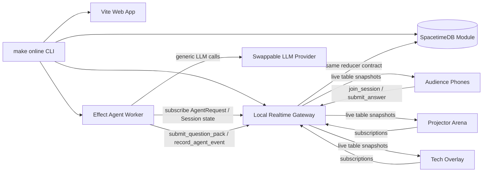

# QuizRush Live

A 25-second real-time quiz tournament from one QR code.

> The whole room scanned one QR code and became a live tournament bracket in 25 seconds.

QuizRush Live uses educational game scoring only. There is no purchase, cash prize, withdrawal, transfer, or real-world value.

## What It Does

QuizRush Live turns a room into a live multiplayer quiz race. The presenter runs `make online`, the projector shows a giant QR code, everyone joins from a phone, topic votes form a live swarm, AI agents generate and review five questions, and the arena shows every answer, score, rank jump, bracket movement, winner, and replay live.

## Demo Flow

1. Run `make online`.
2. Projector opens `/arena/ARENA-42`.
3. Audience scans the QR and joins `/join/ARENA-42`.
4. Everyone picks up to three topics.
5. Press `G` on the projector to run the agent pipeline.
6. Press `S` to start the 25-second match.
7. Phones answer five 5-second questions.
8. Projector updates leaderboard and top-16 bracket from committed state.
9. Winner screen shows champion, score, fastest answer, and confetti.
10. Replay reads the `MatchEvent` ledger to show how the race changed.
11. Press `T` to show the SpacetimeDB tech proof overlay.

Projector keyboard controls:

```text
S = start match
G = generate questions
A = add 100 simulated players
T = toggle tech overlay
F = force finish
R = reset demo
```

## Run

```bash
pnpm install
make online
```

Default local URLs:

- Projector: http://localhost:5173/arena/ARENA-42
- Phone QR: `make online` prints a LAN URL such as `http://YOUR_LAPTOP_IP:5173/join/ARENA-42`
- Tech proof: http://localhost:5173/tech/ARENA-42
- Phone realtime gateway: `ws://YOUR_LAPTOP_IP:8787`
- Worker realtime gateway: ws://127.0.0.1:8787

For room phones on the same Wi-Fi, use the printed QR. If the detected IP is wrong, set it explicitly:

```bash
QUIZRUSH_LAN_HOST=192.168.1.23 make online
```

For phones outside the LAN, expose both the web app and websocket gateway with tunnels and run:

```bash
PUBLIC_BASE_URL=https://your-web-tunnel.example \
PUBLIC_REALTIME_URL=wss://your-realtime-tunnel.example \
make online
```

## Architecture



The SpacetimeDB module in `modules/spacetime` is the authoritative table/reducer contract. The laptop demo also includes `apps/realtime-server`, a local websocket reducer gateway that mirrors the same contract for reliable room demos while generated SpacetimeDB bindings are optional.

## What Works

- Public projector arena at `/arena/:code`.
- Single phone route at `/join/:code`.
- Optional tech proof at `/tech/:code`.
- Realtime joins, topic votes, answers, scores, ranks, bracket, winner, and replay.
- Live projector metrics refreshed by reducer-owned `live_tick` updates.
- Simulated 100-player room load streamed in small reducer batches from the `A` key.
- Simulated answer bursts during the 25-second race for fast leaderboard/bracket movement.
- Reducer-owned game state in `packages/shared` and `modules/spacetime`.
- One answer per participant per round.
- Server-authoritative response time and score calculation.
- Duplicate answer rejection and metric tracking.
- `MatchEvent` replay ledger.
- Effect-based LLM worker with provider routing, retries, validation, safety guard support, and seed fallback.
- NVIDIA model routing through environment variables in `.env.local`.
- Deterministic fallback questions if LLM calls fail.

## What Is Prototype Scope

- Production auth, payments, stored-value accounts, profiles, chat, and content marketplace are intentionally omitted.
- The default judged laptop transport is the local realtime gateway for reliability. The SpacetimeDB module builds and exposes the same public reducers/tables for direct integration.
- Cloudflare/ngrok tunnel startup is not automated; set `PUBLIC_BASE_URL` and `PUBLIC_REALTIME_URL` after starting tunnels.

## AI Agents

- Topic Router Agent: selects a tournament topic from live votes.
- Quiz Builder Agent: generates exactly five short MCQ questions.
- Safety Guard Agent: optional NVIDIA safety review.
- Fairness Agent: validates options, ambiguity, length, and public safety.
- Host Commentator Agent: writes short round commentary.
- Recap Agent: summarizes what the room learned.

Real keys belong only in `.env.local`. `.env.example` contains placeholders.

## Commands

```bash
make online
make reset
make seed
pnpm typecheck
pnpm test
pnpm build
pnpm spacetime:build
```

## SpacetimeDB

```bash
curl -sSf https://install.spacetimedb.com | sh
pnpm spacetime:build
pnpm spacetime:start
pnpm spacetime:publish:local
```

Core reducers:

```text
create_session
join_session
submit_topic_vote
request_questions
submit_question_pack
start_match
start_round
submit_answer
resolve_round
finish_match
heartbeat
live_tick
reset_demo
add_simulated_players
simulate_answer_burst
record_agent_event
```

## Verification

```bash
pnpm typecheck
pnpm test
pnpm --filter @quizrush/web build
```

Manual golden path:

- Join from two browser tabs or phones.
- Lock topics.
- Press `A` to stream 100 simulated players, then `G`, then `S`.
- Answer on phones.
- Tap the same answer twice and verify duplicate rejection in tech overlay.
- Let five rounds resolve.
- Verify winner, leaderboard, replay, and reset.

See `docs/` for architecture diagrams, data model, realtime flow, AI guardrails, demo script, risks, and reducer API contract.
