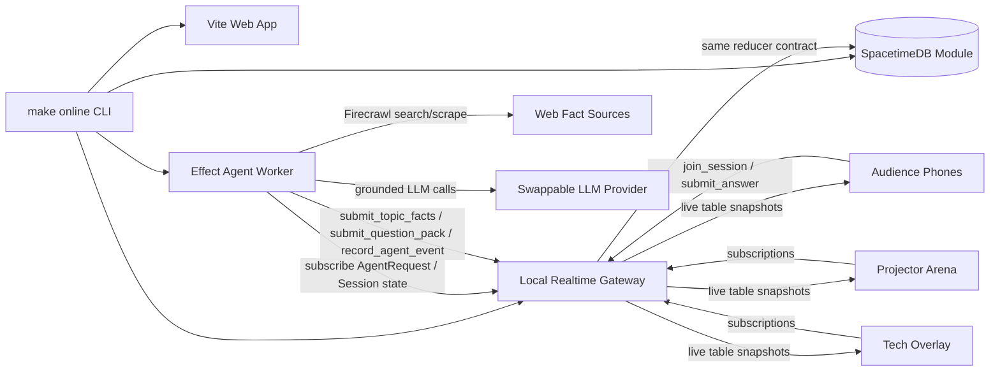

# QuizRush Arena

A 25-second AI-personalized quiz tournament from one QR code.

> The whole room scanned one QR code, shared expertise, and became a live AI-generated tournament in 25 seconds.

QuizRush Arena uses educational game scoring only. There is no purchase, cash prize, withdrawal, transfer, or real-world value.

## What It Does

QuizRush Arena turns a room into a live multiplayer quiz race. The presenter runs `make online-public`, the projector shows a giant QR code, everyone joins from a phone, players type or speak their expertise, deterministic intent parsing converts that into live arena topics, AI agents generate and review ten rapid questions, phones show private quiz prompts, and the projector shows only the public Champion Path fixture, leaderboard, capacity state, and winner.

## Demo Flow

1. Run `make online-public` for phones on any network, or `make online` for same-Wi-Fi testing.
2. Projector opens `/arena/ARENA-42`.
3. Audience scans the QR and joins `/join/ARENA-42`.
4. Everyone types or speaks what they know; fixed topic chips are no longer the main UX.
5. The phone shows a detected arena such as `AI Agents x Space Tech x Database Systems`.
6. The 5-second intent window closes automatically.
7. The phone immediately stores a `PlayerIntent`, starts `request_questions`, and commits a topic-specific instant pack while the Effect worker races cache/template paths and LLM refinement.
8. The match starts automatically and phones answer ten rapid questions inside one 25-second race clock.
9. Projector updates the Champion Path fixture and leaderboard from committed state without showing quiz questions.
10. Winner screen shows champion, score, fastest answer, sound, and confetti.
11. Phones can create a reducer-backed score share link.
12. Press `T` or the hamburger button to open the SpacetimeDB tech drawer with metrics, formulas, capacity, and the `MatchEvent` ledger.

Projector keyboard controls:

```text
S = start match
G = generate questions
A = add 100 simulated players
T = toggle tech overlay
F = force finish
R = reset demo
```

## Run

```bash
pnpm install
make online-public
```

Default local URLs:

- Projector: http://localhost:5173/arena/ARENA-42
- Phone QR: `make online` prints a LAN URL such as `http://YOUR_LAPTOP_IP:5173/join/ARENA-42`
- Tech proof: http://localhost:5173/tech/ARENA-42 or the in-arena hamburger drawer
- Phone realtime gateway: `ws://YOUR_LAPTOP_IP:5173/quizrush-ws`
- Worker realtime gateway: ws://127.0.0.1:8787

For room phones on the same Wi-Fi, use the printed QR. If the detected IP is wrong, set it explicitly:

```bash
QUIZRUSH_LAN_HOST=192.168.1.23 make online
```

If venue Wi-Fi blocks phone-to-laptop traffic or friends are on different networks, use the public tunnel target:

```bash
make online-public
```

`make online-public` tries verified public tunnels in this order: Cloudflare Tunnel, `localhost.run`, then ngrok. It only prints the QR after the public page and websocket both pass preflight. Install Cloudflare Tunnel once with:

```bash
brew install cloudflared
```

You can force a provider during rehearsal:

```bash
make online-cloudflare
make online-localhostrun
make online-ngrok
```

Ngrok free URLs can hit provider warnings or account bandwidth limits. Cloudflare quick tunnels have a 200 in-flight request limit and no uptime SLA. `localhost.run` is useful when venue DNS blocks fresh `trycloudflare.com` hostnames.

For a manual tunnel, expose the web app and set `PUBLIC_BASE_URL`. The websocket rides through the same public origin by default:

```bash
PUBLIC_BASE_URL=https://your-web-tunnel.example make online
```

Only set `PUBLIC_REALTIME_URL` with `VITE_FORCE_REALTIME_URL=true` if you intentionally run a separate websocket tunnel.

## Deploy on Vercel + SpaceTimeDB

Vercel hosts the web app. SpaceTimeDB hosts the realtime database/reducer module. Do not use the local `/quizrush-ws` gateway for production Vercel links.

The module is published as:

```text
Host: https://maincloud.spacetimedb.com
Database: quizrush-live
Dashboard: https://spacetimedb.com/quizrush-live
```

Publish or update SpaceTimeDB:

```bash
pnpm spacetime:build
~/.local/bin/spacetime publish quizrush-live --server maincloud --module-path modules/spacetime --build-options='--lint-dir=' --yes=remote,migrate,break-clients,skip-login
```

Set these Vercel environment variables:

```bash
VITE_REALTIME_TRANSPORT=spacetimedb
VITE_SPACETIMEDB_HOST=https://maincloud.spacetimedb.com
VITE_SPACETIMEDB_MODULE=quizrush-live
VITE_PUBLIC_APP_URL=https://YOUR-VERCEL-DOMAIN
```

Then deploy from the repo root. `vercel.json` builds only `@quizrush/web`, emits `apps/web/dist`, and rewrites deep links such as `/arena/ARENA-42` and `/join/ARENA-42` to the SPA.

```bash
pnpm --filter @quizrush/web build
pnpm dlx vercel --prod
```

The direct SpaceTimeDB browser transport uses generated TypeScript bindings from `apps/web/src/lib/spacetime/module_bindings`, subscribes to the live tables, writes only through reducers, and persists the SpaceTimeDB auth token in local storage so a phone keeps the same participant identity after refresh.

For LLM refinement, keep the Effect agent worker running as a long-lived process pointed at the same reducer contract. Vercel itself should not be the websocket worker runtime:

```bash
AGENT_TRANSPORT=local AGENT_REALTIME_URL=ws://127.0.0.1:8787 pnpm --filter @quizrush/agent-worker start

# Production SpaceTimeDB worker mode:
AGENT_TRANSPORT=spacetime \
AGENT_SPACETIMEDB_HOST=https://maincloud.spacetimedb.com \
AGENT_SPACETIMEDB_MODULE=quizrush-live \
FIRECRAWL_API_KEY=... \
pnpm --filter @quizrush/agent-worker start
```

## Architecture



The SpacetimeDB module in `modules/spacetime` is the authoritative table/reducer contract. The laptop demo also includes `apps/realtime-server`, a local websocket reducer gateway that mirrors the same contract for reliable room demos while generated SpacetimeDB bindings are optional.

## What Works

- Public projector arena at `/arena/:code`.
- Single phone route at `/join/:code`.
- Public score cards at `/share/:slug`.
- Optional tech proof at `/tech/:code`.
- Freeform expertise input with deterministic intent preview and optional Web Speech API mic enhancement.
- Shared transcript cleanup removes repeated interim speech such as `Fruit Fruits Fruits` before reducers see it.
- First-class `PlayerIntent` rows store raw expertise, cleaned text, canonical topics, topic key, arena name, confidence, and pack-ready status.
- Realtime joins, expertise-derived topic votes, answers, scores, ranks, Champion Path fixture, winner, and share links.
- Tasteful generated howler.js sound effects with phone sound off by default.
- Live projector metrics refreshed by reducer-owned `live_tick` updates.
- Simulated 100-player room load streamed in small reducer batches from the `A` key.
- Simulated answer bursts during the 25-second race for fast leaderboard/bracket movement.
- Reducer-owned game state in `packages/shared` and `modules/spacetime`.
- One answer per participant per round.
- Server-authoritative response time and score calculation.
- `clientEventId` idempotency for answer retries.
- Incremental `FinalResult`, `ShareCard`, `SessionCapacity`, and `AdmissionTicket` rows.
- Duplicate answer rejection and metric tracking.
- `MatchEvent` replay ledger hidden in the technical drawer by default.
- Effect-based LLM worker with Firecrawl grounding, provider routing, retries, validation, safety guard support, Instant Quiz Engine cache/template racing, and topic-specific deterministic fallback.
- `TopicFact` rows plus question-level `factIds`, `sourceTitle`, and `sourceUrl` metadata for grounded packs.
- NVIDIA model routing through environment variables in `.env.local`.
- Deterministic topic-specific fallback questions if LLM calls fail or arrive too late.

## What Is Prototype Scope

- Production auth, payments, stored-value accounts, profiles, chat, and content marketplace are intentionally omitted.
- The default judged laptop transport is the local realtime gateway for reliability. The SpacetimeDB module builds and exposes the same public reducers/tables for direct integration.
- Cloudflare/ngrok tunnel startup is automated by `make online-public` when the provider CLI is installed. You can still set `PUBLIC_BASE_URL` manually for a trusted domain.

## AI Agents

The demo does not wait on an LLM to make progress. The intent path is:

```text
phone intent
-> submit_player_intent reducer
-> deterministic normalization
-> topic-specific instant question pack
-> Effect worker exact/alias/semantic/template cache path
-> Firecrawl compact fact retrieval when configured
-> grounded LLM generation/refinement if it returns before the race locks
```

- Intent Parser / Topic Router Agent: selects a tournament topic from live expertise signals.
- Arena Router Agent: represented in the UI pipeline and currently backed by deterministic topic clustering for the single sprint arena.
- Firecrawl Grounding Agent: fetches compact web facts for arbitrary topics and stores them through `submit_topic_facts`.
- Quiz Builder Agent: generates exactly ten short MCQ questions for the 25-second sprint from provided facts when available.
- Safety Guard Agent: optional safety review.
- Fairness Guard: validates options, ambiguity, length, and public safety.
- Host Commentator Agent: writes short round commentary.
- Recap Agent: summarizes what the room learned.

Real keys belong only in `.env.local`. `.env.example` contains placeholders.

## Commands

```bash
make online
make online-public
make online-cloudflare
make online-localhostrun
make online-ngrok
make reset
make seed
pnpm typecheck
pnpm test
pnpm build
pnpm spacetime:build
make load-smoke
make capacity-report
```

## Capacity

Current measured production cap:

```text
MAX_PLAYERS_SOFT=10
MAX_PLAYERS_HARD=12
```

Vercel serves the static frontend. SpacetimeDB is the realtime race engine. Do not claim a higher live-racer count until `docs/capacity-results/` contains a passing load-test artifact for that number.

Architecture docs:

- [Fixture architecture](docs/fixture-architecture.md)
- [Scoring](docs/scoring.md)
- [SpacetimeDB schema](docs/spacetimedb-schema.md)
- [Realtime loop](docs/realtime-loop.md)
- [Capacity](docs/capacity.md)
- [Capacity report](docs/capacity-report.md)

## SpacetimeDB

```bash
curl -sSf https://install.spacetimedb.com | sh
pnpm spacetime:build
pnpm spacetime:start
pnpm spacetime:publish:local
```

Core reducers:

```text
create_session
join_session
submit_topic_vote
submit_player_intent
submit_parsed_intent
request_questions
submit_topic_facts
submit_question_pack
start_match
start_round
submit_answer
resolve_round
finish_match
heartbeat
live_tick
reset_demo
add_simulated_players
simulate_answer_burst
record_agent_event
```

Production transport plan from the SpacetimeDB skills reference:

- Generate TypeScript bindings from `modules/spacetime`.
- Use generated `DbConnection`, `tables`, and reducers from `apps/web/src/lib/spacetime/module_bindings`.
- Subscribe phones only to own participant/score/current round data.
- Subscribe projector to LiveStats, recent MatchEvents, agent events, and top leaderboard rows.
- Keep reducers as the only game-critical mutation path; external LLM calls stay in the Effect worker.

The current room-demo transport is the verified local websocket reducer gateway because it gives reliable public QR joins through tunnels today. The SpacetimeDB module builds and mirrors the same reducer/table contract for the direct SDK transport pass.

## Verification

```bash
pnpm typecheck
pnpm test
pnpm --filter @quizrush/web build
```

Engineering notes:

- Grounded quiz generation: `docs/grounded-quiz-generation.md`
- Capacity assumptions: `docs/capacity-report.md`

Manual golden path:

- Join from two browser tabs or phones.
- Type or say expertise such as `US visa system` or `AI agents, space startups, and databases`.
- Confirm the detected arena.
- The expertise window, generation/fallback, and match start run automatically.
- Press `A` only when you want to stream 100 marked simulated players for load.
- `G` and `S` remain emergency/manual controls.
- Answer on phones.
- Tap the same answer twice and verify duplicate rejection in tech overlay.
- Let seven rapid rounds resolve inside the 25-second race clock.
- Verify winner, leaderboard, replay, and reset.

See `docs/` for architecture diagrams, data model, realtime flow, AI guardrails, demo script, risks, and reducer API contract.
