# Agent Pipeline

QuizRush Arena uses agents to create the sprint, not to mutate scores. Scores, answers, ranks, and replay events remain reducer-owned game state.

## Pipeline

```mermaid
flowchart LR
    Phone[Phone expertise text or speech transcript] --> Intent[Deterministic intent preview]
    Intent --> Reducer[submit_topic_vote reducer]
    Reducer --> Worker[Effect Agent Worker]
    Worker --> Router[Intent Parser / Topic Router Agent]
    Router --> Builder[Quiz Builder Agent]
    Builder --> Guard[Safety + Fairness Guard]
    Guard --> Pack[submit_question_pack reducer]
    Pack --> Arena[25-second sprint]
```

## Current Demo Behavior

- Phone typing is primary.
- Web Speech API is optional and never required.
- Raw audio is not stored or sent to the realtime backend.
- Freeform text is deterministically mapped to compact topics such as `AI Agents`, `Space Tech`, and `Database Systems`; unmatched spoken topics such as `US visa system` are preserved as custom arena topics instead of being forced into a default science/tech bucket.
- The Effect worker uses those live topic signals to route the quiz topic and generate questions.
- If the model is slow or invalid, deterministic topic-specific fallback questions keep the sprint live without reverting to the static demo pack.

## Agent Guardrails

- Return JSON only.
- Validate every model response with Zod.
- Avoid political, medical, legal, financial, sexual, violent, hateful, and gambling content.
- Keep questions short enough for a 5-second phone answer.
- Do not invent citations.
- Do not let agents mutate score, rank, answer, or replay state directly.

## Production Expansion

The next production pass should add first-class `PlayerIntent`, `Arena`, and `ArenaMember` tables in SpacetimeDB. That would let multiple quiz arenas run in parallel while the global leaderboard uses normalized arena-relative scores.
