# Agent Pipeline

QuizRush Arena uses agents to create the sprint, not to mutate scores. Scores, answers, ranks, and replay events remain reducer-owned game state.

## Pipeline

```mermaid
flowchart LR
    Phone[Phone expertise text or speech transcript] --> Intent[Deterministic intent preview]
    Intent --> IntentReducer[submit_player_intent reducer]
    IntentReducer --> VoteReducer[submit_topic_vote / request_questions reducers]
    VoteReducer --> Instant[Instant topic pack committed]
    VoteReducer --> Worker[Effect Agent Worker]
    Worker --> Router[Intent Parser / Topic Router Agent]
    Router --> Cache[Exact / alias / semantic cache race]
    Cache --> Grounding[Firecrawl Grounding Agent]
    Grounding --> Facts[submit_topic_facts reducer]
    Facts --> Builder[Grounded Quiz Builder Agent]
    Builder --> Guard[Safety + Fairness Guard]
    Guard --> Pack[submit_question_pack reducer]
    Pack --> Arena[25-second sprint]
```

## Current Demo Behavior

- Phone typing is primary.
- Web Speech API is optional and never required.
- Raw audio is not stored or sent to the realtime backend.
- Interim speech results are display-only. Only final transcripts are committed, then repeated words/phrases are removed.
- `submit_player_intent` stores raw text, cleaned text, canonical topics, topic key, arena name, confidence, and status in realtime state.
- Freeform text is deterministically mapped to compact topics such as `AI Agents`, `Space Technology`, and `Database Systems`; spoken topics such as `US visa system` and `Fruit Fruits Fruits` become `US Visa System` and `Fruit Science`.
- `request_questions` creates an `AgentRequest` and keeps the room live with the fastest valid pack available.
- When configured, the Effect worker calls Firecrawl, extracts compact facts, stores them with `submit_topic_facts`, and asks the LLM to generate questions from those facts only.
- The Effect worker records Instant Quiz Engine, Firecrawl Grounding Agent, Quiz Builder, Safety Guard, and Fairness Agent events while LLM generation can refine before the race locks.
- NVIDIA routes are split by job: nano for topic/commentary, author for quiz packs, reasoning for fairness, and safety guard for safety review.
- If a model route is saturated, cooling down, slow, invalid, or rate-limited, deterministic topic-specific fallback questions keep the sprint live without reverting to the static demo pack.

## Agent Guardrails

- Return JSON only.
- Validate every model response with Zod.
- Avoid political, medical, legal, financial, sexual, violent, hateful, and gambling content.
- Keep questions short enough for a 5-second phone answer.
- Do not invent citations.
- If Firecrawl facts are provided, every generated question must include at least one supplied `factId`.
- Do not let agents mutate score, rank, answer, or replay state directly.

## Production Expansion

The next production pass should add `Arena` and `ArenaMember` tables for multiple parallel quiz arenas. The `PlayerIntent` table/reducer path now exists in the shared engine and SpacetimeDB module contract.
