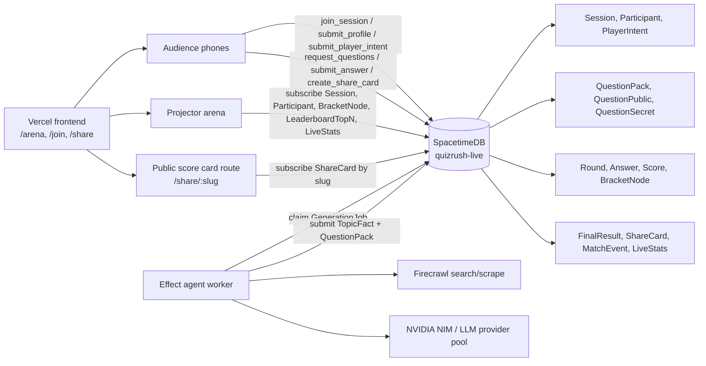
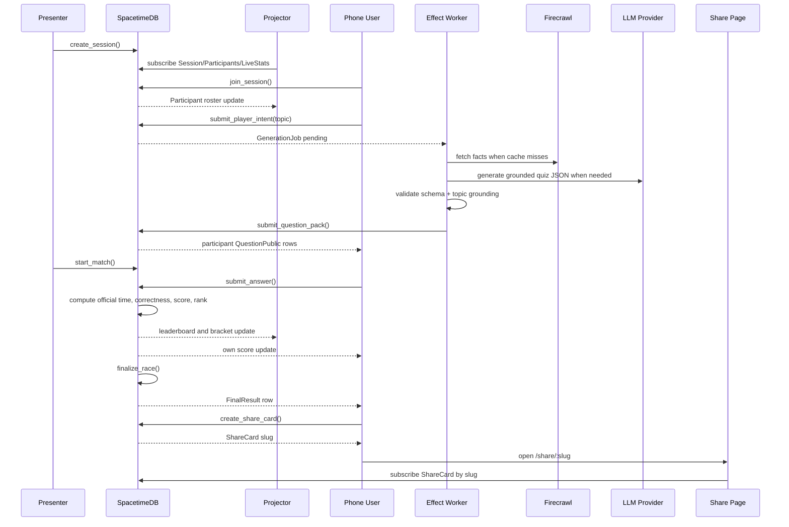
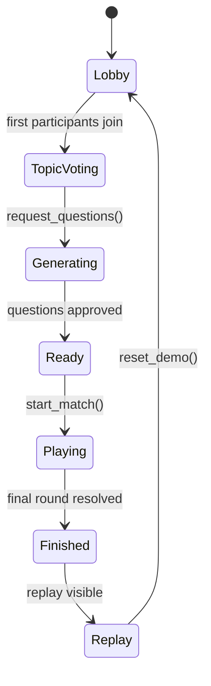
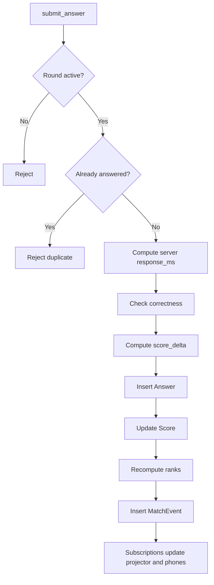

# Architecture

QuizRush Arena is built around one judged workflow: a public arena QR, a one-route phone controller, freeform topic intent, AI-generated or cached private questions, a 25-second match, live bracket movement, and durable share-card replay.

## Production System



Vercel only serves the application shell and routes. SpacetimeDB owns the realtime game state: profiles, intents, quiz pack assignment, hidden answers, official timing, score, rank, bracket movement, final results, and share-card slugs. The Effect worker performs external I/O, then writes compact facts and validated packs back through reducers.

## Realtime Sequence



## State Machine



## Scoring Flow



## Packages

- `apps/web`: projector arena, phone route, tech overlay.
- `apps/realtime-server`: local websocket reducer gateway for offline rehearsal only.
- `apps/agent-worker`: Effect-powered agent worker and provider-neutral LLM adapters.
- `modules/spacetime`: SpacetimeDB table/reducer module matching the shared contract.
- `packages/shared`: reducer engine, types, schemas, scoring, fallback questions, tests.

## SpacetimeDB Usage

- Phones call reducers for `join_session`, `submit_profile`, `submit_player_intent`, `request_questions`, `submit_answer`, and `create_share_card`.
- The projector subscribes to public rows only: `Session`, `Participant`, `PlayerIntent`, `BracketNode`, `LeaderboardTopN`, `FinalResult`, and `LiveStats`.
- Phones subscribe to their own private quiz surface: assigned `QuestionPublic` rows, `Round`, `Score`, `FinalResult`, and `ShareCard`.
- The agent worker claims `GenerationJob` rows, fetches facts outside the database, validates packs, and submits compact `TopicFact`, `QuestionPack`, `QuestionPublic`, and `QuestionSecret` rows through reducers.
- The share page loads a durable `ShareCard` row by slug. It never reconstructs score cards from URL text.

Production transport follows the generated TypeScript binding pattern from the SpacetimeDB skills reference:

```text
spacetime build
spacetime publish
spacetime generate --lang typescript
DbConnection.builder()
subscribe(tables...)
ctx.reducers.reducerName(...)
```

The local reducer gateway remains available for offline rehearsal, but the deployed architecture is Vercel plus the `quizrush-live` SpacetimeDB module.
