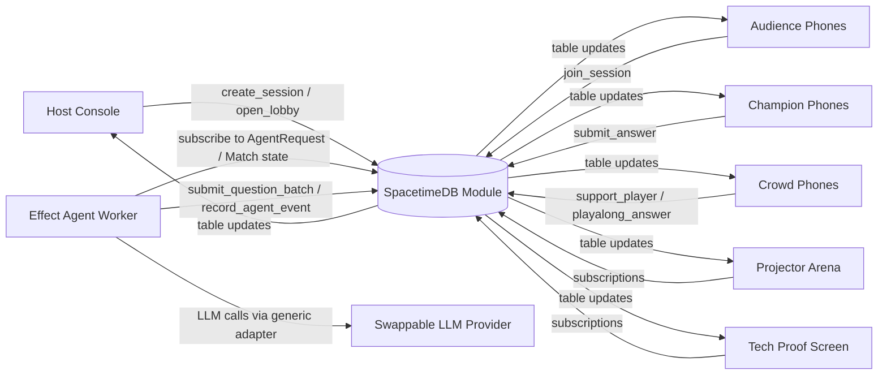
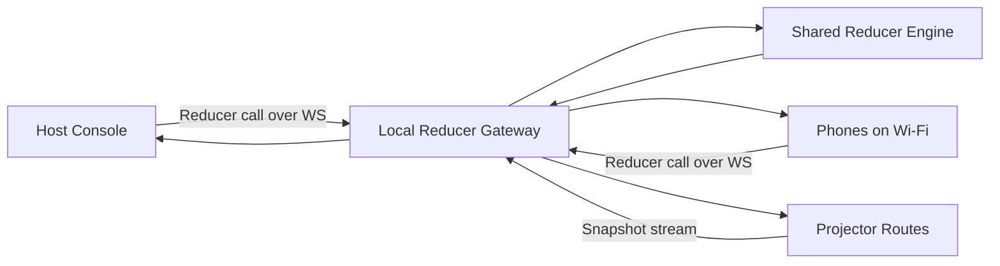
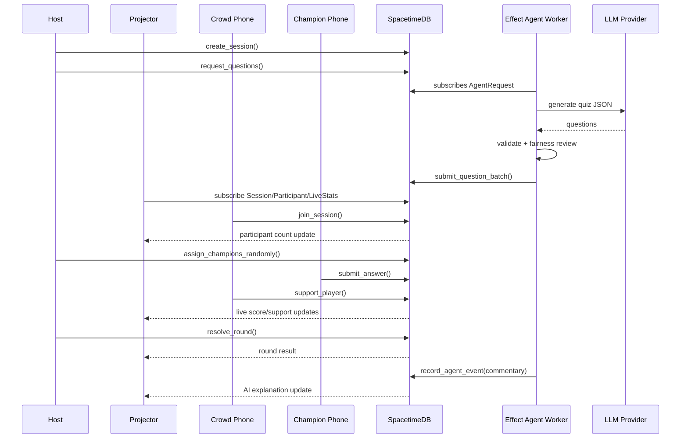
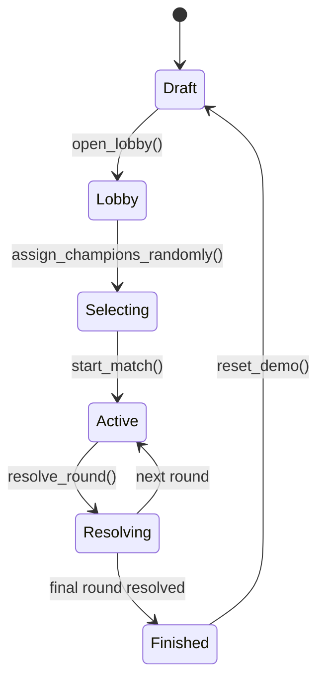
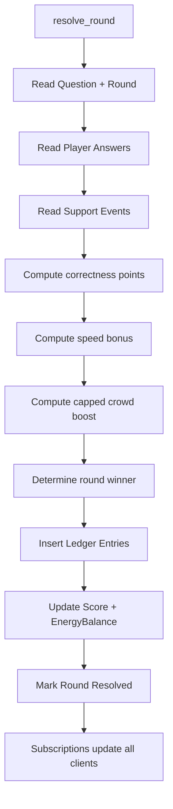

# Architecture

QuizDuel Live is organized as a monorepo:

- `apps/web`: React phone, host, projector, and tech proof screens.
- `apps/realtime-server`: laptop-local WebSocket reducer gateway for the judged demo.
- `apps/agent-worker`: Effect-based provider-neutral LLM worker.
- `modules/spacetime`: build-verified SpacetimeDB TypeScript module.
- `packages/shared`: shared types, schemas, reducer engine, scoring, and tests.

## System

## Demo Transport

The local gateway exists so a judged demo can run from one laptop without cloud login. Its reducer names, arguments, and invariants mirror the SpacetimeDB module.

## Realtime Sequence

## Match State

## Scoring Flow

