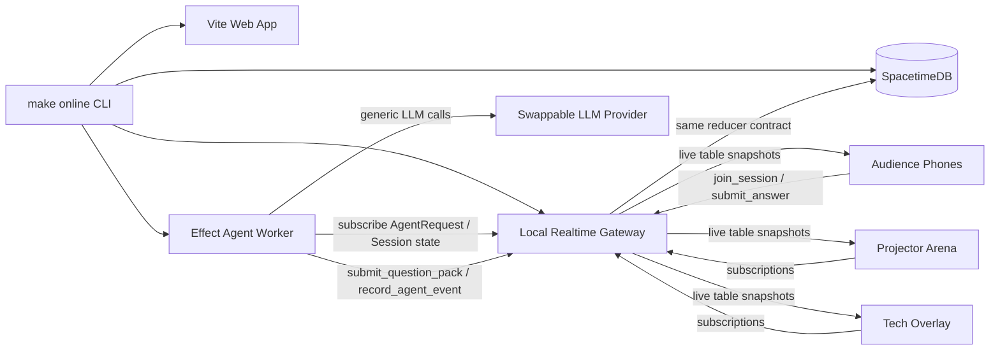
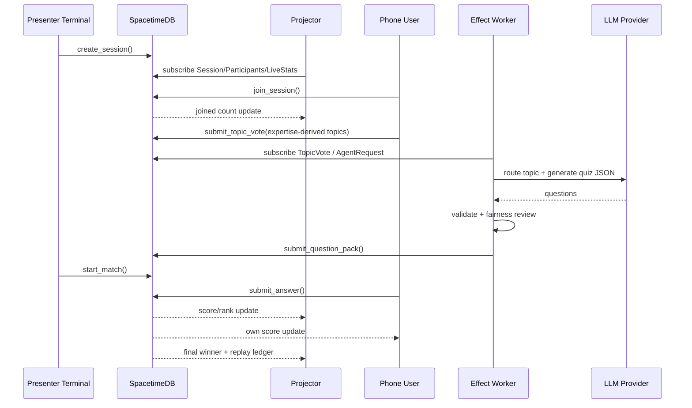
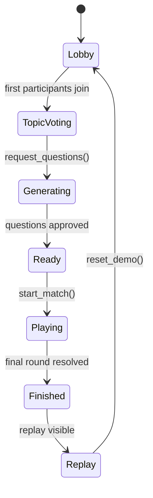
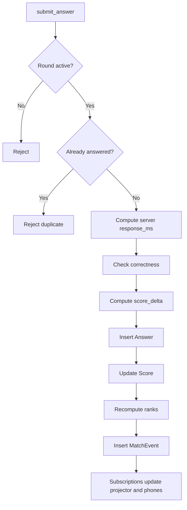

# Architecture

QuizRush Arena is built around one judged workflow: a public arena QR, a one-route phone controller, freeform expertise intent, AI-generated questions, a 25-second match, and event-ledger replay.

## System



## Realtime Sequence



## State Machine



## Scoring Flow



## Packages

- `apps/web`: projector arena, phone route, tech overlay.
- `apps/realtime-server`: laptop websocket reducer gateway for reliable local demos.
- `apps/agent-worker`: Effect-powered agent worker and provider-neutral LLM adapters.
- `modules/spacetime`: SpacetimeDB table/reducer module matching the shared contract.
- `packages/shared`: reducer engine, types, schemas, scoring, fallback questions, tests.

## SpacetimeDB SDK Direction

The production transport should follow the generated TypeScript binding pattern from the SpacetimeDB skills reference:

```text
spacetime build
spacetime publish
spacetime generate --lang typescript
DbConnection.builder()
subscribe(tables...)
ctx.reducers.reducerName(...)
```

The current public demo keeps the reducer gateway active because it has been verified through venue-safe tunnels. The reducer/table model remains aligned with the SpacetimeDB module so this is a transport swap, not a product rewrite.
