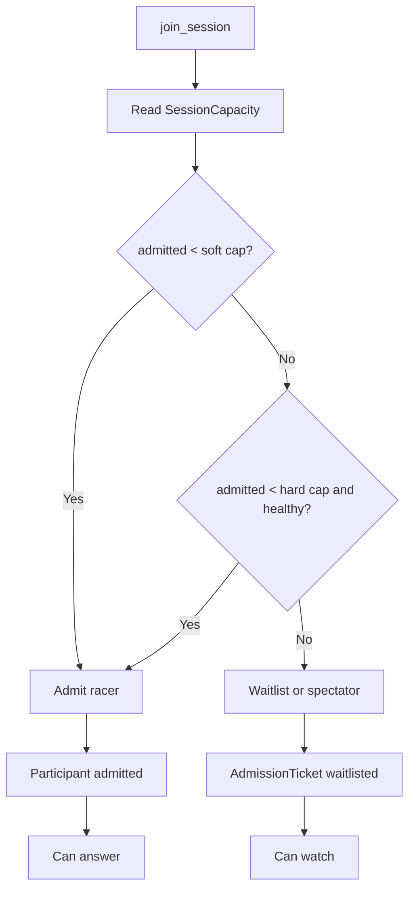

# Capacity

The current deployed Vercel + SpacetimeDB system has been load tested. The safe active racer cap is:

```text
MAX_PLAYERS_SOFT=100
MAX_PLAYERS_HARD=100
```

This is an admission-control setting, not a product failure. It protects answer latency and ensures the final result can appear quickly.



## Measured Boundary

See [capacity-report.md](capacity-report.md) for raw load-test results. Latest production results:

```text
20 connected active racers: pass, 200/200 answers committed, 20 FinalResult rows, 20 ShareCard rows.
50 connected active racers: pass, 500/500 answers committed, 50 FinalResult rows, 50 ShareCard rows.
100 connected active racers: pass, 1000/1000 answers committed, 100 FinalResult rows, 100 ShareCard rows.
250 connected users: measured fail under overflow pressure; do not claim yet.
```

Keep `MAX_PLAYERS_HARD=100` for active racers. Overflow users are stored as tracked participants/waitlisted spectators instead of seeing reducer failures, but they should not be admitted into the active answer race until load tests prove it.

## Scaling Path

1. Maintain a `LeaderboardTopN` table instead of pushing all scores to every client.
2. Add explicit bracket-slot tables if the fixture needs exact historical layout rows.
3. Reduce per-answer `MatchEvent` fanout.
4. Re-run `make load USERS=100`, then 250, then 500 with scoped subscriptions.
5. Raise `MAX_PLAYERS_HARD` only after a passing artifact is committed.
