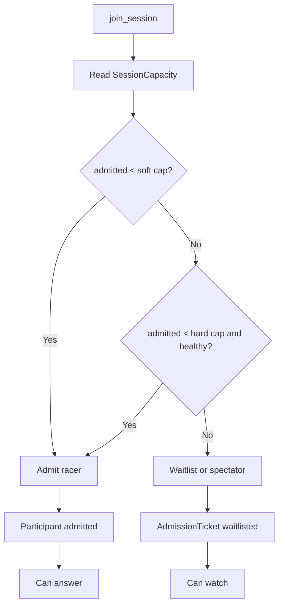

# Capacity

The current deployed Vercel + SpacetimeDB system has been load tested. The safe active racer cap is:

```text
MAX_PLAYERS_SOFT=10
MAX_PLAYERS_HARD=12
```

This is an admission-control setting, not a product failure. It protects answer latency and ensures the final result can appear quickly.



## Measured Boundary

See [capacity-report.md](capacity-report.md) for raw load-test results. Latest production results:

```text
50 connected users: pass, 12 admitted racers, 50 FinalResult rows, 50 ShareCard rows.
100 connected users: functionally complete, degraded answer p95 at 1285ms.
250 connected users: failed join/intention writes; not safe for current deployment.
```

Keep `MAX_PLAYERS_HARD=12` for active racers. Overflow users are still stored as tracked participants/waitlisted spectators when joins succeed, but they should not be admitted into the active answer race until load tests prove it.

## Scaling Path

1. Split public question data from hidden answer data.
2. Replace broad subscriptions with scoped per-phone subscriptions.
3. Maintain a `LeaderboardTopN` table instead of pushing all scores to every client.
4. Add explicit bracket-slot tables if the fixture needs exact historical layout rows.
5. Re-run `make load USERS=50`, then 100, then 250 with scoped subscriptions.
6. Raise `MAX_PLAYERS_HARD` only after a passing artifact is committed.
