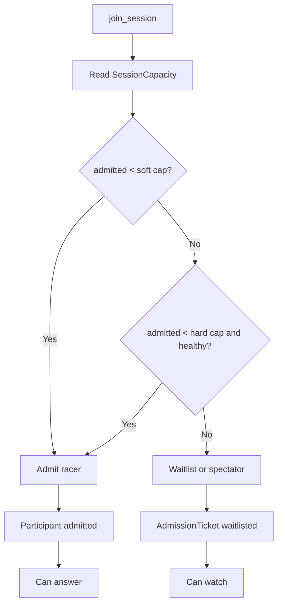

# Capacity

The current deployed Vercel + SpacetimeDB system has been load tested. The safe active racer cap is:

```text
MAX_PLAYERS_SOFT=10
MAX_PLAYERS_HARD=12
```

This is an admission-control setting, not a product failure. It protects answer latency and ensures the final result can appear quickly.



## Measured Boundary

See [capacity-report.md](capacity-report.md) for raw load-test results. Latest 10-question smoke result:

```text
Users: 10
Committed answers: 100 / 100
Rounds resolved: 10 / 10
Answer p95: 35ms
Vercel static p95: 175ms
```

The previous 12-user boundary was measured on the earlier 7-question flow. Keep `MAX_PLAYERS_HARD=12`, but do not raise the cap until a 12-user, 10-question artifact passes.

## Scaling Path

1. Split public question data from hidden answer data.
2. Replace broad subscriptions with scoped per-phone subscriptions.
3. Maintain a `LeaderboardTopN` table instead of pushing all scores to every client.
4. Add explicit bracket-slot tables if the fixture needs exact historical layout rows.
5. Re-run `make load USERS=50`, then 100, then 250.
6. Raise `MAX_PLAYERS_HARD` only after a passing artifact is committed.
