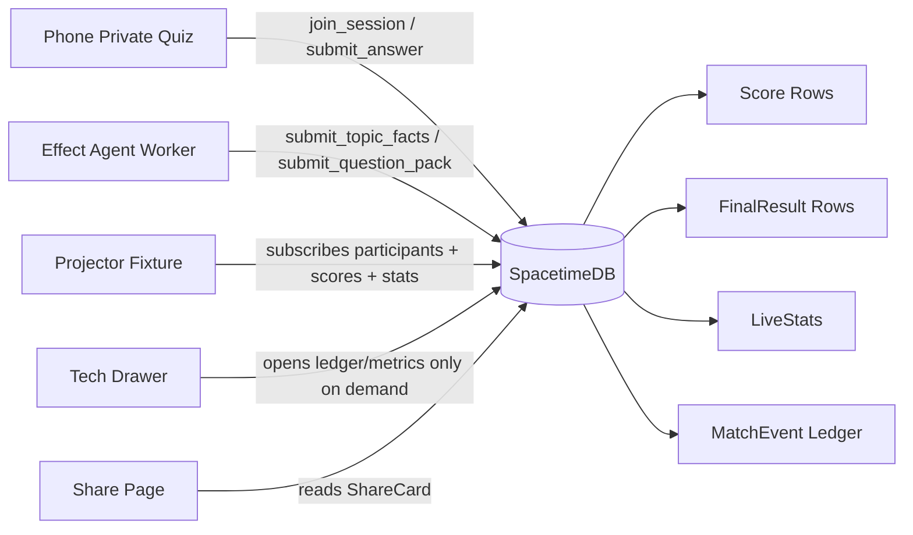
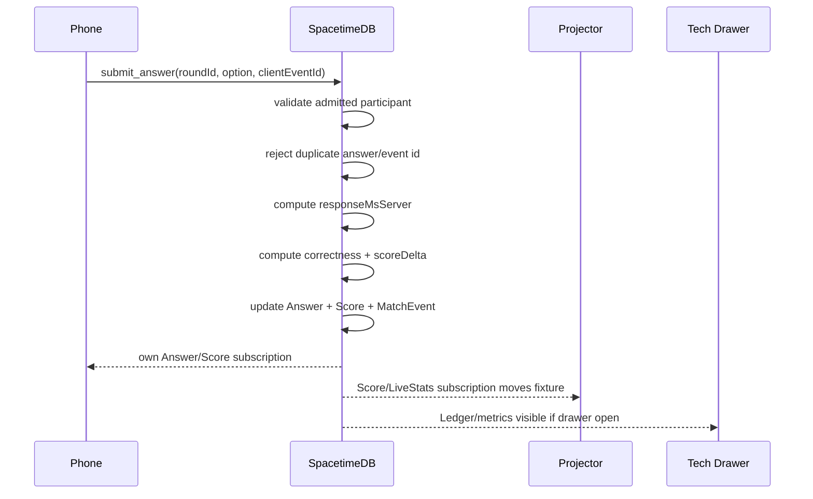

# Fixture Architecture

QuizRush Arena now treats the projector as a public tournament broadcast. Phones show the private quiz; the projector shows the live Champion Path derived from committed SpacetimeDB rows.

## Product Split

- Phone: name, avatar, topic, private questions, answer buttons, own result, share score.
- Projector: QR lobby, Champion Path fixture, leaderboard, winner reveal, capacity strip.
- Tech drawer: formulas, reducers, latency, capacity, MatchEvent ledger.

The projector does not render quiz questions or correct answers. This keeps personalized topics private and prevents the public screen from becoming a debug dashboard.

## Current Implementation

The current deployed fixture is derived from authoritative `Score`, `Participant`, `LiveStats`, and `FinalResult` rows. Avatar movement follows subscribed rank/score changes committed by reducers.

The next production scaling pass should add explicit `BracketStage`, `BracketSlot`, `AdvancementEvent`, and `EliminationEvent` tables if the tournament visualization must preserve a full historical bracket independent of rank.
