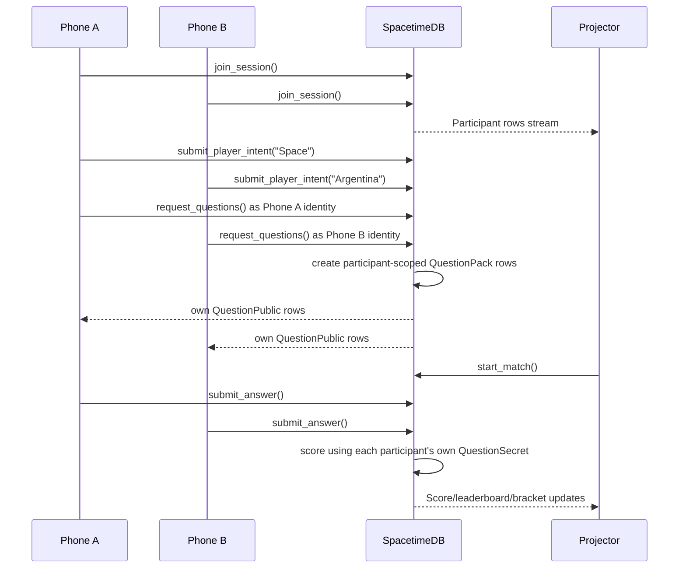

# Multiplayer Debugging

Date: 2026-06-07

## Root Cause Fixed

The “one phone works, second phone fails” issue was caused by two unsafe multiplayer assumptions:

1. `request_questions` was session-wide.
   A phone entering a topic could delete and replace the room’s `QuestionPack`, `QuestionPublic`, `QuestionSecret`, and `Round` rows while other phones were joining.

2. The projector could auto-start a real-user race as soon as the first pack was ready.
   Late phones then hit `join_session` while the session was already `playing`, which returned a reducer failure instead of a recoverable state.

The fix:

- Phone `request_questions` calls now use the phone’s SpacetimeDB identity.
- SpacetimeDB stores phone packs with `participant_id`.
- Session/operator packs remain room-wide and are only used as shared fallback timing content.
- `submit_answer` scores against the caller’s own question for the active round index when one exists.
- Real-user projector auto-start is disabled; only simulated rehearsal mode auto-starts.
- Late joins become tracked `spectator` participants instead of fatal reducer failures.
- `make diagnose SESSION=ARENA-42` prints live production SpacetimeDB state.

## Current Verified Capacity

Current deployed target:

```text
Vercel: https://quizel-eta.vercel.app
SpacetimeDB: https://maincloud.spacetimedb.com / quizrush-live
MAX_PLAYERS_SOFT=20
MAX_PLAYERS_HARD=25
```

Verified load:

| Scenario | Result |
| --- | --- |
| 20 synthetic phones | 20 joined, 20 admitted, 200/200 answers committed, 20 FinalResult rows, 20 ShareCard rows |
| 50 synthetic phones | 50 joined/tracked, 25 admitted, 25 waitlisted, 250/250 admitted answers committed, 50 FinalResult rows, 50 ShareCard rows |

Do not claim more than this until a newer capacity artifact passes.

## Diagnose Command

```bash
make diagnose SESSION=ARENA-42
```

This prints:

- Vercel URL
- SpacetimeDB host/module
- session status/capacity
- participant rows
- admission tickets
- player intents
- generation jobs
- participant-scoped question packs
- rounds, scores, final results, share cards
- reducer failures, client errors, agent events, match events

## Multiplayer Flow



## Important Invariants

- Frontend never creates official score, rank, timing, final result, or share URL.
- `QuestionSecret` remains private to reducers.
- Share URLs are created from durable `ShareCard.slug`.
- Normal reset preserves `ShareCard` rows.
- Per-phone quiz state must include `participantId`.
- Overflow users must be waitlisted/spectators, not failed reducer calls.

