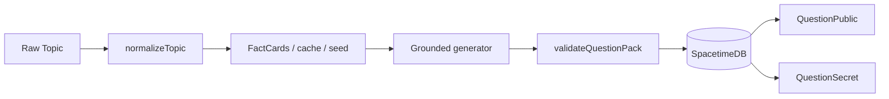

# Question Grounding

Quiz generation is now normalized and validated before storage.

## Pipeline

## Rules

- `sPACE` normalizes to `Space` with topic key `space::intermediate`.
- `Andaman` normalizes to `Andaman Islands`.
- Focused Space packs must contain space, astronomy, planet, orbit, satellite, rocket, mission, NASA, star, galaxy, or related terms.
- Focused Andaman packs must contain Andaman-specific geography, administration, ecology, history, or landmark terms.
- Meta-learning questions are rejected, including “best first step”, “how to study”, “valid quiz question”, “know key terms”, “skip basics”, “ignore context”, and “avoid examples”.
- Public clients receive question text and options only. Correct answers live in private `QuestionSecret` rows.
