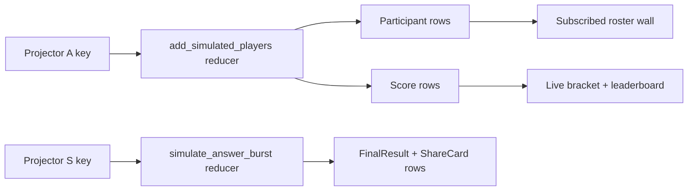
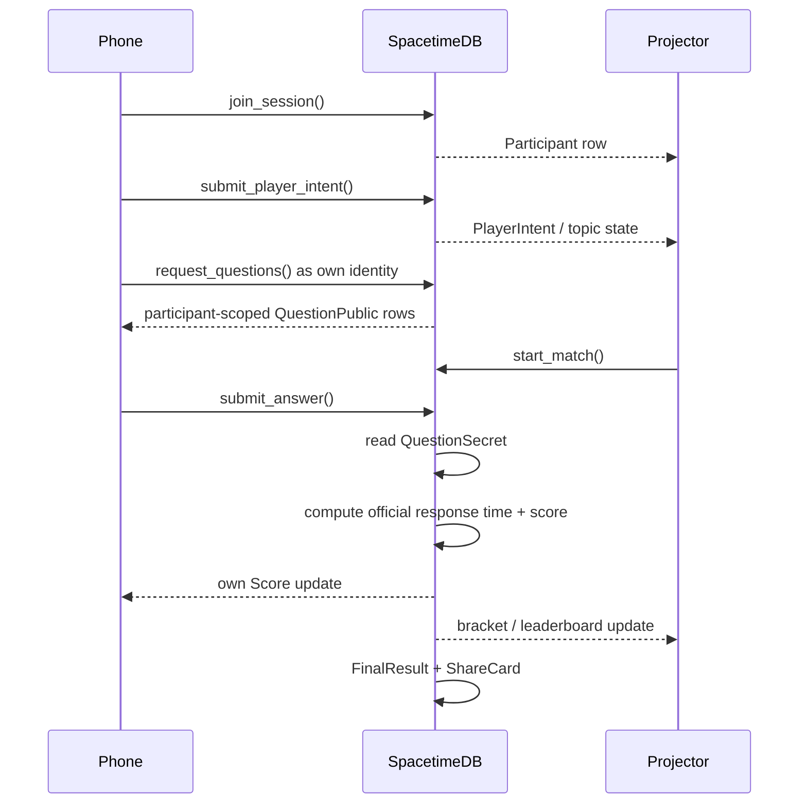
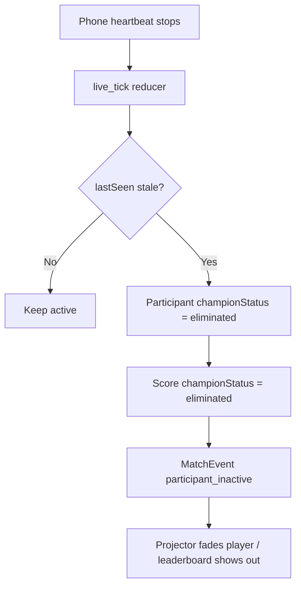

# Realtime Demo Runbook

Use this during rehearsal and judging.

## Production Demo

```text
Projector: https://quizel-eta.vercel.app/arena/ARENA-42
Phones: scan the QR or open https://quizel-eta.vercel.app/join/ARENA-42
Share pages: https://quizel-eta.vercel.app/share/:slug
```

Real phones create `Participant`, `PlayerIntent`, `Score`, `Answer`, `FinalResult`, and `ShareCard` rows in SpacetimeDB. The frontend only renders subscribed state.

## What To Say

```text
Vercel hosts the web app. SpacetimeDB owns the live race: profiles, topics, question packs, answers, timing, score, rank, final results, and share cards.
```

Current measured admission:

```text
100 active racers passed
100 active racers hard cap
250 connected tracked users measured but not claimed; current 250-audience run caused late answers
```

Do not claim 250 active real racers yet.

## Rehearsal Load Controls

The public lobby is intentionally clean. For rehearsal, use projector keyboard controls:

```text
A = add reducer-backed simulated participants
S = start the visual race
R = reset the session
```

These controls create reducer-backed simulated participants for visual rehearsal. They are useful when the room has fewer people than the target demo size.

The visual path is:



## Live Phone Flow



## Leave Handling

Phones heartbeat every 5 seconds. During a live race, `live_tick` marks a real admitted participant as eliminated if the phone is stale past the timeout. The participant row, score, answers, final result, and share card remain stored.



## Recovery

If the room is too large:

```text
Keep active racer cap at 100.
Let overflow users watch/waitlist.
Use visual rehearsal buttons only when clearly described as reducer-backed simulated load.
```
