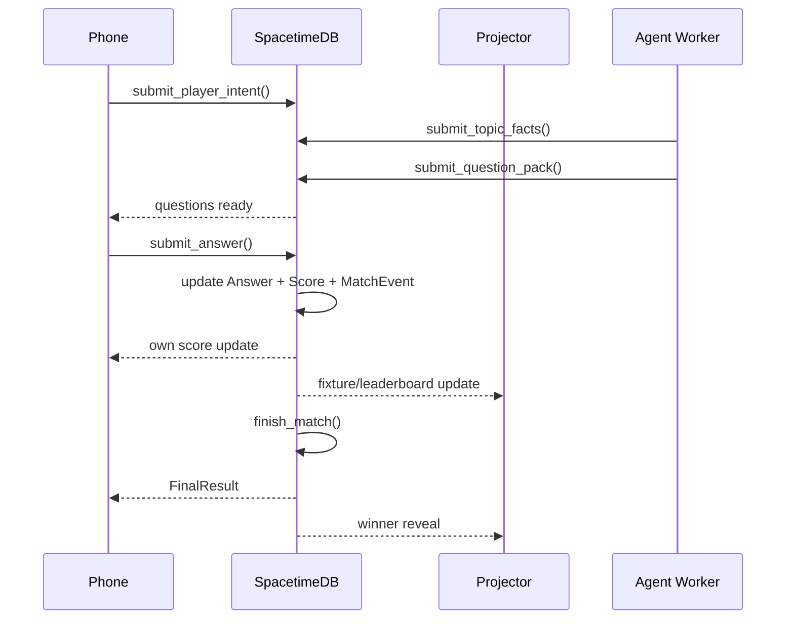

# Realtime Loop

QuizRush Arena is designed so final results are already mostly computed by the time the last round ends.

## Latency Strategy

- Vercel serves the static React app.
- SpacetimeDB owns realtime reducer writes and subscriptions.
- The Effect worker runs outside Vercel serverless and submits quiz packs through reducers.
- Scores update incrementally on every answer.
- Finish snapshots `FinalResult` rows instead of recomputing from scratch on the phone.

## Subscription Strategy

Current deployed clients subscribe broadly, which is why measured active racer capacity is conservative. The next scaling pass should narrow subscriptions:

- Phone: own participant, own current round/question, own answer, own score, own final result, own share card.
- Projector: admitted participants, top leaderboard, live stats, final results.
- Tech drawer: MatchEvent and operation traces only when opened.
