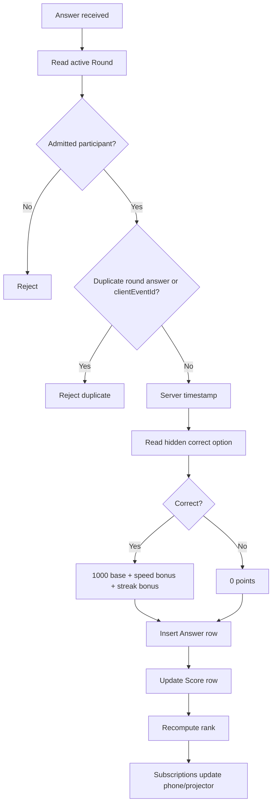

# Scoring

The official score is calculated inside `submit_answer`. The phone can animate immediately after a tap, but score, correctness, response time, and rank come from subscribed rows.



## Formula

```text
responseMsServer = serverReceivedAtMs - round.startsAtMs
responseMsClamped = clamp(responseMsServer, 0, 2500)

if correct:
  correctnessPoints = 1000
  speedBonus = floor(1000 * (1 - responseMsClamped / 2500))
  streakBonus = previousAnswerWasCorrect ? 100 : 0
else:
  correctnessPoints = 0
  speedBonus = 0
  streakBonus = 0

scoreDelta = correctnessPoints + speedBonus + streakBonus
```

## Rank Comparator

```text
1. totalScore desc
2. correctCount desc
3. totalResponseMsServer asc
4. fastestResponseMsServer asc
5. lastAnswerAtMs asc
6. participantId asc
```

## Stored Per Answer

- selected option
- hidden correctness result
- server response time
- client timestamp for analytics only
- client event id for idempotency
- correctness points
- speed bonus
- streak bonus
- score delta
- server receipt timestamp

The client cannot set official score, rank, correctness, or response time.
