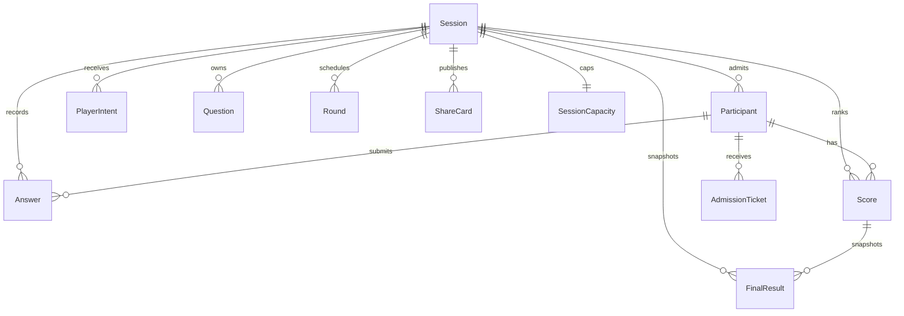
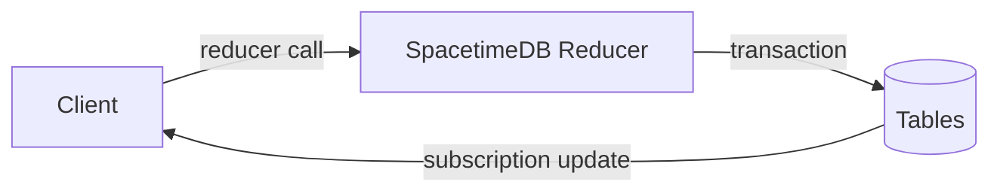

# SpacetimeDB Schema

The database module is in `modules/spacetime`. It is the authoritative race contract for Vercel clients and the Effect worker.

## Core Tables

| Table | Purpose |
| --- | --- |
| `Session` | Code, phase, selected topic, timing, admitted count, capacity state. |
| `Participant` | Identity, display name, avatar, admission status, champion status. |
| `PlayerIntent` | Raw topic text, cleaned/canonical arena, confidence, pack status. |
| `TopicFact` | Compact Firecrawl/local facts used to ground quiz packs. |
| `Question` | Public question text/options plus source metadata for the current contract. |
| `Round` | Server start/end timestamps for each 2.5-second question. |
| `Answer` | One authoritative answer per participant per round. |
| `Score` | Incremental score/rank counters updated on each answer. |
| `FinalResult` | Final snapshot created at finish, so results render quickly. |
| `ShareCard` | Public score-share snapshot and unique slug. |
| `SessionCapacity` | Soft/hard racer cap and waitlist counts. |
| `AdmissionTicket` | Per-participant admission/waitlist/rejected state. |
| `MatchEvent` | Reducer ledger for technical drawer and replay reconstruction. |
| `LiveStats` | Reducer metrics, p95s, answer rate, capacity status. |

## Reducer Boundary

Reducers own all game-critical mutations. Clients only render subscribed state.
