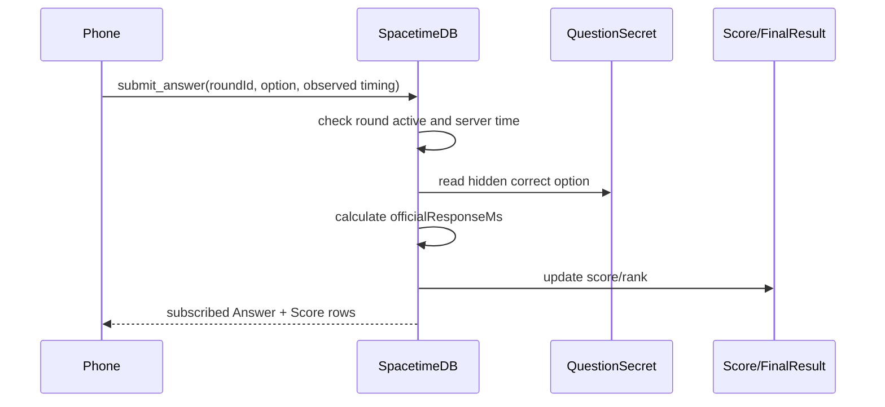

# Timing And Scoring

SpacetimeDB is authoritative for official timing, correctness, score, rank, and final result.

## Timing

Rounds are scheduled in the future:

```text
startsAtServerMs = serverNow + ROUND_LEAD_TIME_MS
endsAtServerMs = startsAtServerMs + QUESTION_TIME_MS
```

Official response time:

```text
officialResponseMs = serverReceivedAtMs - startsAtServerMs
```

Observed tap time:

```text
observedResponseMs = clientClickedAtMs - clientQuestionRenderedAtMs
```

Observed tap time is stored only for diagnostics and can be flagged as suspicious. It never decides score or rank.

## Scoring

```text
if correct:
  scoreDelta = 1000 + floor(1000 * (1 - officialResponseMs / QUESTION_TIME_MS)) + streakBonus
else:
  scoreDelta = 0
```

Rank comparator:

```text
totalScore desc
correctCount desc
totalOfficialResponseMs asc
fastestOfficialResponseMs asc
lastAnswerAtMs asc
participantId asc
```

## Mermaid


